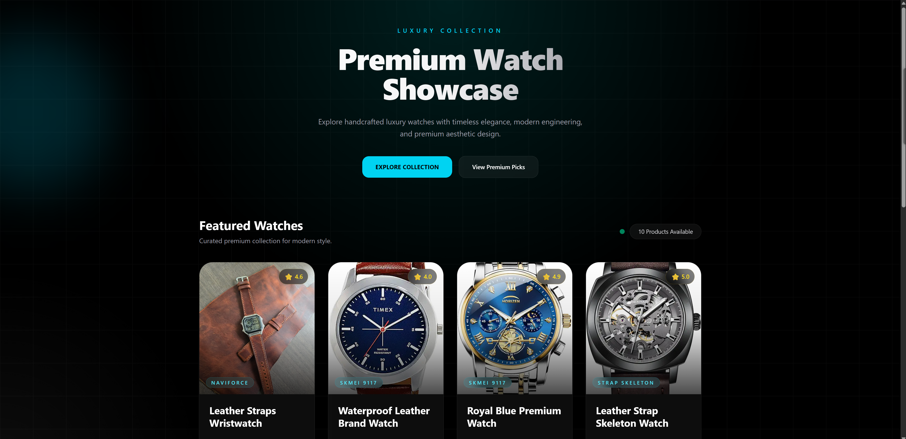
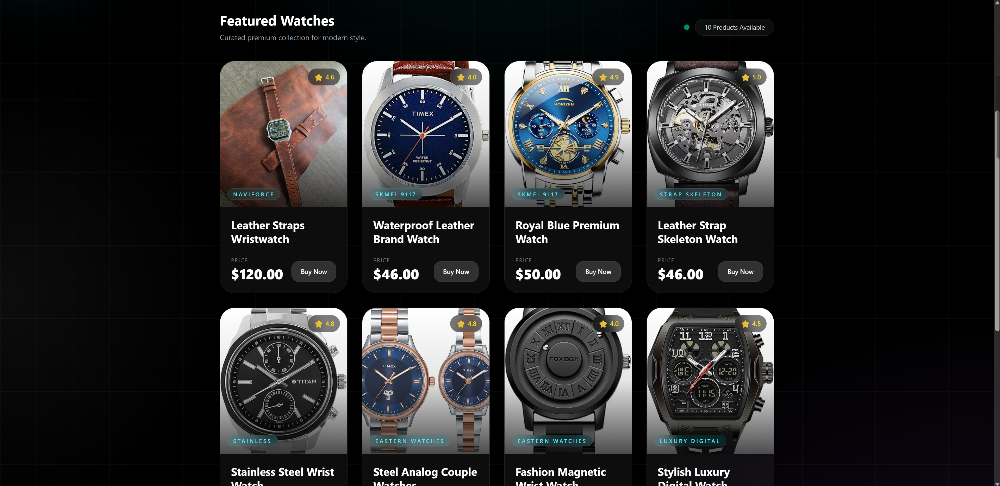

# ⌚ Premium Watch Showcase

A modern React product showcase app that displays premium watches using data fetched from a public API.

---

# ✨ Features

- Fetches real product data from API
- Displays premium watch collection
- Loading state handling
- Dynamic product rendering
- Reusable React components
- Built with React + TypeScript
- Beginner-friendly project structure

---

# 🚀 Tech Stack

- React
- TypeScript
- Vite
- Fetch API

---

# 📸 Project Screenshots

## Demo 1



---

## Demo 2



---

# 📂 Folder Structure

```bash
src/
├── components/
│   └── ProductCard.tsx
│
├── types/
│   └── product.ts
│
├── App.tsx
│
└── main.tsx
```

---

# ⚙️ Installation

## 1. Clone the repository

```bash
git clone <your-repository-url>
```

---

## 2. Move into project folder

```bash
cd project-name
```

---

## 3. Install dependencies

Using pnpm:

```bash
pnpm install
```

---

## 4. Run development server

```bash
pnpm dev
```

---

# 🌐 API Used

```bash
https://api.freeapi.app
```

---

# 📚 What I Learned

- React fundamentals
- useState hook
- useEffect hook
- Fetching API data
- Component-based architecture
- Props in React
- TypeScript basics in React
- Conditional rendering
- Dynamic UI rendering using map()

---

## ✨ Author

**Ashish Kumar Jha**  
📍 India • Full Stack Developer

---

## 📬 Contact

- GitHub: https://github.com/Ashishjha013
- LinkedIn: https://www.linkedin.com/in/ashishjha13
- Email: ashishjha1304@gmail.com

---
